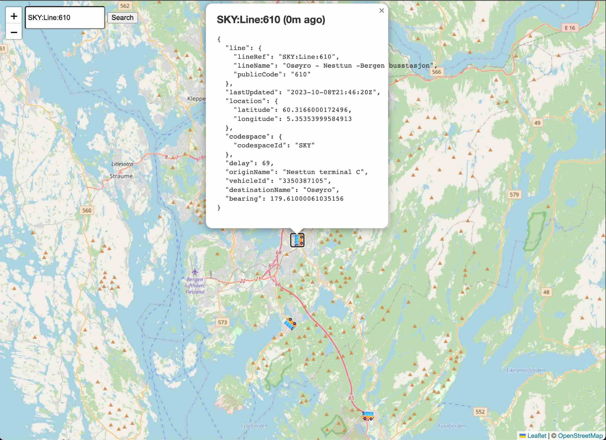

# Entur Bus-tracker-norway

[Live website](https://mathiash98.github.io/Bus-tracker-norway-entur/?lineRef=SKY%3ALine%3A4)

Entur's website for tracking buses (which has more features and much better UX): https://vehicle-map.entur.org/

Simple website to visualise all buses in Norway using Entur API
See Entur API website for more information: https://developer.entur.org/pages-real-time-vehicle
GraphQL explorer used to build query: [Entur GraphQL Explorer](https://api.entur.io/graphql-explorer/vehicles?query=%7B%0A%20%20vehicles%28codespaceId%3A%20%22SKY%22%29%20%7B%0A%20%20%20%20line%20%7B%0A%20%20%20%20%20%20lineRef%0A%20%20%20%20%20%20lineName%0A%20%20%20%20%20%20publicCode%0A%20%20%20%20%7D%0A%20%20%20%20lastUpdated%0A%20%20%20%20location%20%7B%0A%20%20%20%20%20%20latitude%0A%20%20%20%20%20%20longitude%0A%20%20%20%20%7D%0A%20%20%20%20codespace%20%7B%0A%20%20%20%20%20%20codespaceId%0A%20%20%20%20%7D%0A%20%20%20%20delay%0A%20%20%20%20originName%0A%20%20%20%20vehicleId%0A%20%20%20%20destinationName%0A%20%20%20%20bearing%0A%20%20%7D%0A%7D%0A)

## TODO:

- [ ] Subscribe to changes over graphql websocket subcription
- [ ] Easier filtering of buses
- [ ] Restrict subscription to only buses in view
- [x] Filter lineRef by http query param
